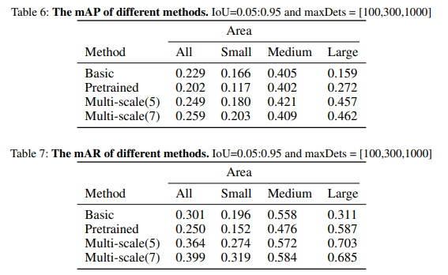
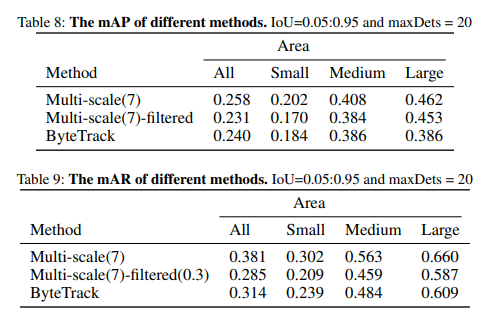

# Final-Project-Liquid-Tracking
The link to our report: .   
Our pre-training model:   
https://drive.google.com/file/d/1qq5Y5HP59EsrEySABaaCVD_zkko-sKCU/view?usp=sharing.    
Our trained model:   
https://drive.google.com/file/d/1lhz-IwxjVIf9bgSwDKWf3oPaCbv-s37N/view?usp=sharing.  
Our dataset:  
https://drive.google.com/file/d/1iQmfIvSf5w4ETFXZ2uTysv_Kl71ti8nl/view?usp=sharing.

# Overview
In this task, our work can be divided into about three parts.  
First, design a basic model. Second, improve the performance of the basic model. Third, try to use the MOT method to improve the performance of the model.  Here, we will introduce the code framework used in the three parts.  
We use *colab* for this task, so all the codes are in *ipynb* format.
## Part1 - Basic model
We use *YOLO* model under *mmdetection* framework for training. The specific model configuration file is called *yolov3_d53_mstrain-416_273e_coco.py*.  
Here is a link to mmdetection: https://github.com/open-mmlab/mmdetection.  
We haven't saved the trained model here, only the test results.
## Part2 - Improvements
We use two methods to improve the performance of the basic model.  
First, we try to pretrain the *YOLO* model on *Trans10k* dataset.  
Second, we try to scale the test image to different scales, and then integrate all the results as the final result.  
Here we present a table shows all the results.  
  
The code is saved in *improvement.ipynb*.
## Part3 - Attempts to use MOT method
To take advantage of the connection between the video frames, we try to use MOT method to improve the model's performance.  
The structure we are trying to use here is ByteTrack. The specific ByteTrack code is shown in *improvement.ipynb*.  
We have made some small changes to the internal codes of ByteTrack to meet our requirements.  
Here we present a table shows all the results.  
 
